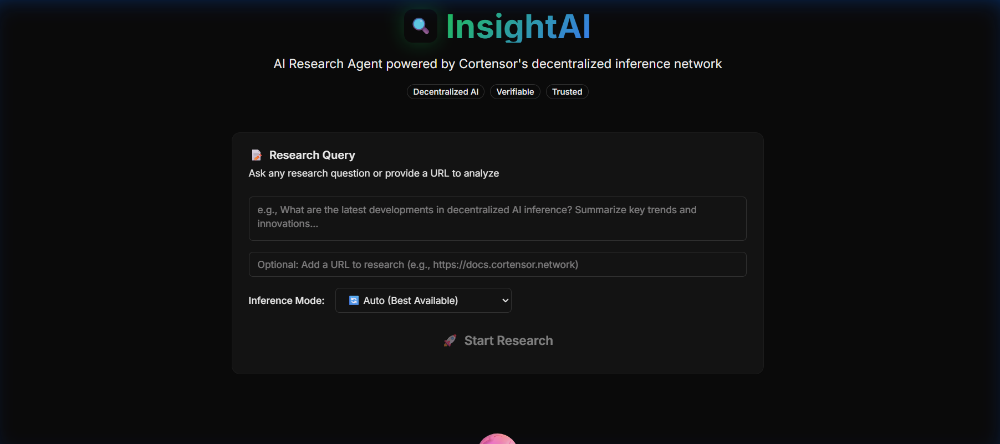
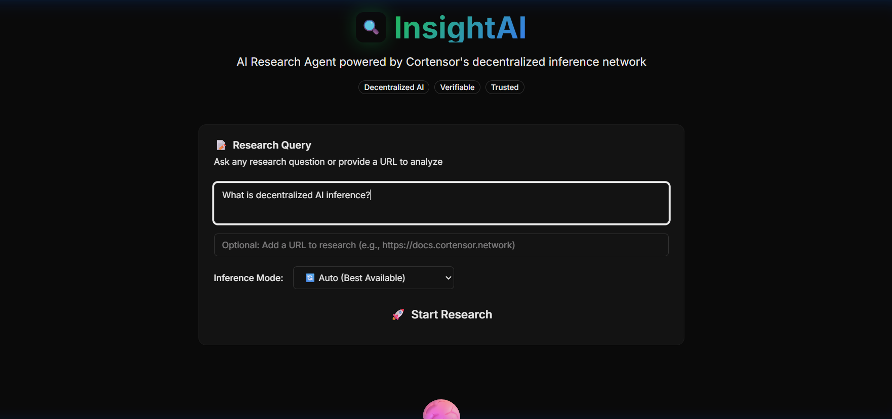
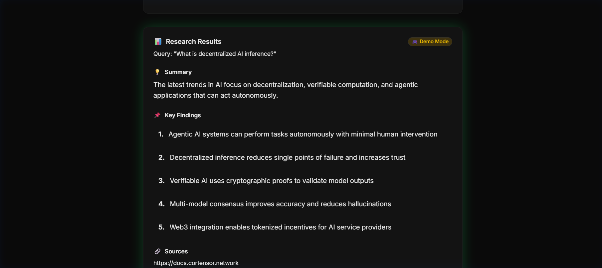

# InsightAI 🔍

> **Agentic AI Research Assistant** powered by Cortensor's decentralized inference network


---

## 🎯 What is InsightAI?

InsightAI is a **decentralized AI research assistant** that acts autonomously to provide verified research insights. Instead of relying on a single AI provider, InsightAI leverages Cortensor's **multi-miner consensus** and **blockchain verification** for trustworthy outputs.

### Why Decentralized Research?

| Traditional AI | InsightAI + Cortensor |
|----------------|----------------------|
| Single provider = single point of failure | 94+ distributed miners |
| No verification of outputs | Blockchain TX verification |
| Opaque inference process | Session + Task ID transparency |
| Centralized trust | Decentralized consensus |

---

## 📖 User Flow - How It Works

### Step 1: Enter Your Research Query
Visit the app and type your research question in the input field. Examples:
- *"What are the latest developments in decentralized AI?"*
- *"Explain how proof of inference works in blockchain"*
- *"Summarize the benefits of multi-node AI consensus"*

### Step 2: (Optional) Add a URL
Want to analyze specific content? Paste a URL and InsightAI will fetch and analyze it:
- Documentation pages
- Blog posts
- Research articles

### Step 3: Select Inference Mode
Choose how your query gets processed:

| Mode | Description | When to Use |
|------|-------------|-------------|
| 🔄 **Auto** | Automatically selects best available | Default - recommended |
| � **Router API** | Uses local Cortensor router node | When running your own node |
| ⛓️ **Web3 SDK** | Direct smart contract interaction | For on-chain verification |
| 🎮 **Demo** | Simulated responses | Testing without network |

### Step 4: Click "Start Research"
InsightAI processes your query through Cortensor's decentralized network:

```
Your Query → InsightAI API → Cortensor Router → 94+ Miners → Consensus Result
```

### Step 5: View Verified Results
Receive your research output with:
- **📝 Summary** - Concise overview of findings
- **📌 Key Findings** - Bullet points of important details
- **🔗 Sources** - Referenced URLs
- **✅ Verification Badge** - Proof of decentralized processing

### Step 6: Verify on Blockchain
Click "View on Cortensor Dashboard" to see:
- Session ID
- Task ID
- Transaction hash
- Miner participation details

---

## 🔄 Complete User Journey Diagram

```
┌──────────────────────────────────────────────────────────────────────┐
│                         USER JOURNEY                                  │
└──────────────────────────────────────────────────────────────────────┘
                                  │
                                  ▼
┌──────────────────────────────────────────────────────────────────────┐
│  1. OPEN APP                                                          │
│     └── Visit https://insightai-chi.vercel.app                       │
│     └── See premium dark UI with glassmorphism design                │
└──────────────────────────────────────────────────────────────────────┘
                                  │
                                  ▼
┌──────────────────────────────────────────────────────────────────────┐
│  2. ENTER QUERY                                                       │
│     └── Type research question in textarea                           │
│     └── Optionally add URL to analyze                                │
│     └── Select inference mode (Auto recommended)                     │
└──────────────────────────────────────────────────────────────────────┘
                                  │
                                  ▼
┌──────────────────────────────────────────────────────────────────────┐
│  3. PROCESSING                                                        │
│     └── Click "🚀 Start Research" button                             │
│     └── Watch ⚡ spinning animation                                   │
│     └── Query sent to Cortensor network                              │
└──────────────────────────────────────────────────────────────────────┘
                                  │
                                  ▼
┌──────────────────────────────────────────────────────────────────────┐
│  4. BEHIND THE SCENES (Cortensor Network)                            │
│     ├── Router node receives request                                 │
│     ├── Task distributed to 94+ miners                               │
│     ├── Miners process with Gemma 3 / LLaMA models                   │
│     ├── Consensus reached on best response                           │
│     └── Result + TX hash returned                                    │
└──────────────────────────────────────────────────────────────────────┘
                                  │
                                  ▼
┌──────────────────────────────────────────────────────────────────────┐
│  5. VIEW RESULTS                                                      │
│     ├── 💡 Summary paragraph displayed                               │
│     ├── 📌 Key findings as numbered list                             │
│     ├── 🔗 Source links shown                                        │
│     ├── ✅ "Verified via Cortensor" badge                            │
│     └── Session ID displayed                                         │
└──────────────────────────────────────────────────────────────────────┘
                                  │
                                  ▼
┌──────────────────────────────────────────────────────────────────────┐
│  6. VERIFY ON-CHAIN                                                   │
│     └── Click "View on Cortensor Dashboard →"                        │
│     └── See full transaction details                                 │
│     └── Verify miner participation                                   │
└──────────────────────────────────────────────────────────────────────┘
```
---

## 📸 Screenshots

### Landing Page

*Premium dark UI with glassmorphism design*

### Enter Research Query

*Type your research question and select inference mode*

### Research Results

*Verified results with summary, key findings, and sources*

---

## ⚡ Key Functionalities

### 1. Research Query Processing
```javascript
// User Input
"What is proof of inference in decentralized AI?"

// InsightAI Processing
→ Validates input (length, content)
→ Builds structured prompt
→ Sends to Cortensor Router API
→ Receives multi-miner consensus response
→ Parses into summary + bullet points
→ Returns with verification data
```

### 2. URL Analysis
```javascript
// User provides URL
"https://docs.cortensor.network"

// InsightAI Processing
→ Fetches URL content
→ Combines with user query
→ Sends enriched prompt to Cortensor
→ Returns analyzed summary of the page
```

### 3. Structured Output Parsing
Raw LLM response gets transformed:
```
INPUT:  "Decentralized AI uses multiple nodes... - Point 1 - Point 2"
OUTPUT: {
  summary: "Decentralized AI uses multiple nodes...",
  bulletPoints: ["Point 1", "Point 2"],
  verified: true,
  sessionId: "132",
  taskId: "45"
}
```

### 4. Verification System
Every response includes verification data:
- **Session ID**: Links to your Cortensor session
- **Task ID**: Specific task within the session
- **TX Hash**: Blockchain transaction proof (Web3 mode)
- **Dashboard Link**: Direct link to verify on Cortensor

---

## �🏆 Hackathon Track: Agentic Applications

InsightAI fits the **Agentic Applications** track as an autonomous research assistant that:

- ✅ **Acts autonomously** on user queries without step-by-step guidance
- ✅ **Monitors** and handles network availability with graceful fallbacks
- ✅ **Produces verifiable outputs** with blockchain transaction verification
- ✅ **Free public access** - no API keys required for end users

---

## ⚡ Cortensor Integration 

### Features Used

| Feature | Implementation |
|---------|---------------|
| **Router Node API** | `/api/v1/completions/{sessionId}` for inference |
| **Session Management** | TestNet 0 session creation and tracking |
| **Multi-Miner Inference** | Queries processed by 94+ decentralized nodes |
| **Blockchain Verification** | TX hash provided for each response |
| **WebSocket Communication** | Real-time router node connectivity |

### Architecture

```
┌─────────────────┐     ┌─────────────────┐     ┌─────────────────┐
│   InsightAI     │────▶│ Cortensor       │────▶│ Decentralized   │
│   Frontend      │     │ Router Node     │     │ Miners (94+)    │
└─────────────────┘     └─────────────────┘     └─────────────────┘
         │                       │                       │
         │                       ▼                       │
         │              ┌─────────────────┐              │
         │              │ Session #132    │              │
         │              │ LLaMA 3.1 8B    │              │
         │              └─────────────────┘              │
         │                       │                       │
         │                       ▼                       │
         └──────────────│ Blockchain TX   │◀─────────────┘
                        │ Verification    │
                        └─────────────────┘
```

---

## 🎨 Features & UI

### Core Features

| Feature | Description |
|---------|-------------|
| 🔍 **Research Query** | Natural language research questions |
| 🌐 **URL Analysis** | Summarize content from any web page |
| ✅ **Verified Results** | Badge shows Cortensor verification status |
| 📊 **Structured Output** | Summary + bullet points format |
| 🔄 **Mode Selection** | Choose Auto, Router, Web3, or Demo |
| 🎮 **Demo Fallback** | Works when TestNet is unavailable |

### Premium UI Features

- 🌙 Dark mode with glassmorphism effects
- ✨ Smooth animations and micro-interactions
- 📱 Fully responsive design
- 🎯 One-click research queries
- 🔗 Direct links to verification dashboard

---

## 🚀 Quick Start

### Prerequisites
- Node.js 18+
- npm or yarn

### Installation

```bash
# Clone the repository
git clone https://github.com/himanshu-sugha/Insightai
cd insightai

# Install dependencies
npm install

# Start development server
npm run dev
```

Open [http://localhost:3000](http://localhost:3000)

### Environment Variables

Create `.env.local`:

```env
# Cortensor Router Configuration
CORTENSOR_ROUTER_URL=http://localhost:5010
CORTENSOR_API_KEY=your-api-key-from-dashboard
CORTENSOR_SESSION_ID=132

# Web3 SDK Mode (optional)
CORTENSOR_PRIVATE_KEY=your-wallet-private-key

# Force demo mode
USE_MOCK=false
```

---

## 🤖 Agent Specification

### Actions

| Action | Description | Trigger |
|--------|-------------|---------|
| `research_query` | Process natural language research questions | User enters query |
| `url_analysis` | Fetch and summarize web content | User provides URL |
| `structured_output` | Format response as summary + bullet points | Automatic |
| `verification_link` | Provide Cortensor dashboard link | On every response |

### Safety Guardrails

- 🛡️ **Rate Limiting** - Prevents API abuse
- 🛡️ **Input Validation** - Checks query length and content
- 🛡️ **Timeout Handling** - 15-second timeout with graceful fallback
- 🛡️ **No PII Storage** - No user data stored on server
- 🛡️ **Demo Fallback** - Ensures availability when network down

---

## 💻 Tech Stack

| Layer | Technology |
|-------|------------|
| **Framework** | Next.js 16 (App Router + Turbopack) |
| **Styling** | Tailwind CSS v4 |
| **Components** | shadcn/ui |
| **Backend** | Cortensor Router API |
| **Blockchain** | Arbitrum Sepolia TestNet |
| **Deployment** | Vercel (Edge Functions) |
| **Web3** | ethers.js for contract interaction |

---

## 📋 Transparency Notes

- **Centralized Components**: Vercel hosting, Next.js server functions
- **No Paid Services**: Uses only Cortensor TestNet (free) and Vercel free tier
- **Data Sources**: User-provided queries, public URLs only

---

## 🔗 Links

- **Live Demo**: [https://insightai-chi.vercel.app](https://insightai-chi.vercel.app)
- **GitHub**: [https://github.com/himanshu-sugha/Insightai](https://github.com/himanshu-sugha/Insightai)
- **Community PR**: [cortensor/community-projects #78](https://github.com/cortensor/community-projects/pull/78)
- **Cortensor Docs**: [https://docs.cortensor.network](https://docs.cortensor.network)

---

## 📝 License

MIT License - see [LICENSE](LICENSE) file.

---

**Built for Cortensor Hackathon #3** 🚀
